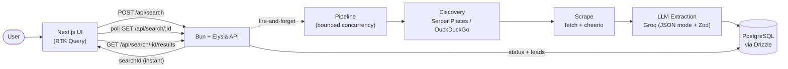

# Lead Discovery MVP

Enter a keyword + location (e.g. **"Cleaning Business" / "Australia"**), and the app discovers
public web pages, uses an LLM to pull structured business info out of them, and shows the
results in a table with a source link for every row.

## Architecture



The API responds to `POST /api/search` immediately with a `searchId`; the pipeline runs in the
background and the frontend polls status every 1.5s until it completes.

- **Frontend**: Next.js (App Router) + TypeScript + Tailwind CSS + Redux Toolkit + RTK Query.
  RTK Query polls `GET /api/search/:id` every 1.5s while a search is in progress, then fetches
  `GET /api/search/:id/results` once it completes.
- **Backend**: Bun + Elysia.js. `POST /api/search` creates a row and kicks off the pipeline in
  the background (fire-and-forget), so the request returns instantly with a `searchId`.
- **Discovery**: `apps/api/src/services/discovery.ts`. Uses **Serper.dev's Places API**
  (Google Maps data, free trial credits) if `SERPER_API_KEY` is set — this returns real,
  already-identified businesses (name, address, phone, website) directly, which matters:
  a plain organic web search for "`<keyword>` in `<location>`" mostly surfaces "how to start
  a cleaning business" articles, industry reports and forum threads, not actual businesses,
  and the LLM correctly rejects all of those as non-leads. Falls back to DuckDuckGo's HTML
  endpoint (free, no key required, generic organic search) if no Serper key is set, so the
  app works out of the box — with lower precision, since it's back to a plain web search.
- **Scraping**: `apps/api/src/services/scrape.ts`. Plain `fetch` + `cheerio`, strips
  scripts/styles/nav, truncates to ~6k chars. No headless browser — good enough for most
  business/listing pages within a 1-week budget; the tradeoff is it won't render JS-heavy sites.
- **LLM extraction**: `apps/api/src/services/extract.ts`. Uses **Groq** (OpenAI-compatible API,
  generous free tier) with a JSON-mode prompt and Zod validation. Two extraction paths: for
  Places candidates, the LLM only fills in email/description from the business's own site
  (`extractEmailAndDescription`) since name/phone/address are already known and trusted; for
  DuckDuckGo candidates, it does full extraction including judging whether a page is a business
  at all (`extractLead`). Any malformed response or non-business page is dropped rather than
  crashing the search. Default model is `openai/gpt-oss-20b` — Groq's Llama text models were
  retired from their catalog since this plan was written; gpt-oss-20b is the current
  fast/cheap/JSON-mode-capable equivalent (verify against `GET /openai/v1/models` if it drifts
  again).
- **Pipeline**: `apps/api/src/services/pipeline.ts` runs discovery → scrape → extract → store
  with bounded concurrency (3 pages at a time), basic dedup on business name, and per-page
  error isolation — one bad URL never kills the whole search.

### Why not ScrapeGraphAI directly?

The original plan named ScrapeGraphAI as the scraping layer. Its open-source library is MIT
licensed, but the managed cloud API (`scrapegraph-js`/`scrapegraph-py`) is a paid,
credit-based service, not a free tier — worth mentioning explicitly if this comes up in the
interview. For a 1-week unpaid build, this MVP swaps in a free discovery/scrape stack instead
(DuckDuckGo + cheerio) and keeps the same modular boundary, so swapping in ScrapeGraphAI's
`searchScraper`/`smartScraper` later is a drop-in replacement for `discovery.ts` + `scrape.ts`
if the team has budget for it.

## Data model

`searches (id, keyword, location, status, candidate_count, processed_count, error_message,
created_at, completed_at)` — one search has many `leads (id, search_id, business_name,
location, phone, email, website, description, source_url, created_at)`.

## Setup

### 1. Start Postgres

```bash
docker compose up -d
```

### 2. Backend

```bash
cd apps/api
cp .env.example .env
# fill in GROQ_API_KEY (free at https://console.groq.com)
# SERPER_API_KEY is optional — leave blank to use the free DuckDuckGo fallback
bun install
bun run db:push   # creates the searches/leads tables from src/db/schema.ts
bun run dev       # http://localhost:4000
```

### 3. Frontend

```bash
cd apps/web
cp .env.example .env.local
bun install
bun run dev       # http://localhost:3000
```

### 4. Try it

Open http://localhost:3000, enter **Cleaning Business** / **Australia**, and watch the status
update through discovering → scraping → extracting → completed.

## Testing

```bash
cd apps/api
bun test
```

Covers: input validation (empty/whitespace-only keyword or location), the lead-extraction Zod
schemas (well-formed payloads, missing fields, wrong types — i.e. malformed LLM output),
`scrapePage` against a local test server (HTML extraction, 404s, non-HTML content-type,
unreachable hosts — all resolving to `null` rather than throwing, since one bad page must
never crash a whole search), dedup-key normalization, CSV escaping, unknown-search-id 404s,
and a static guard that server-only secrets (`GROQ_API_KEY`, `SERPER_API_KEY`) are never
referenced anywhere in the web app's source. Requires Postgres running (`docker compose up -d`)
since a couple of route tests hit the real DB (read-only). Frontend has no automated test suite
yet — out of scope for the time budget; it's been manually verified end-to-end (see below).

## Known limitations

- No headless browser, so JavaScript-rendered pages won't scrape.
- Discovery quality depends on which backend is active — without a `SERPER_API_KEY`, the
  DuckDuckGo fallback is a generic web search and will surface far fewer real businesses
  than Serper's Places API (Google Maps data). A working `SERPER_API_KEY` is effectively
  required for a good demo.
- Email is best-effort: it's only found if the business publishes it in plain text on the
  page we scrape (usually the homepage). Businesses that gate contact info behind a form
  will show `email: null`.
- Ambiguous city names without a country (e.g. "London" — could be UK or Ontario) can return
  a mix of regions. We send the location both folded into the query text and as Places'
  dedicated `location` field, which meaningfully improves this, but Google's own Places data
  doesn't guarantee full disambiguation from a bare city name. Typing "London, UK" instead of
  "London" avoids it entirely.
- This is a lead-discovery tool over public pages, not an exhaustive business registry — it
  will not find every business in a country or city.
- No auth, multi-tenancy, CRM features, billing, or job queue (Redis) — all deliberately out of
  scope per the original plan.
- CSV export and dedup are implemented but basic (exact-match dedup on business name).

## Status

Manually verified end-to-end against multiple real keyword/location combos (Cleaning
Business/Australia, Plumbers/London, Bakery/Toronto) — real businesses returned with
name/address/phone/website and, where published, email. Backend test suite (`bun test`,
30 tests) covers validation, schema handling, scraping edge cases, dedup, and the
API-keys-not-in-frontend guard. Not yet done: deployment (currently localhost-only — see
plan section 15's "working demo or deployment, if required").

